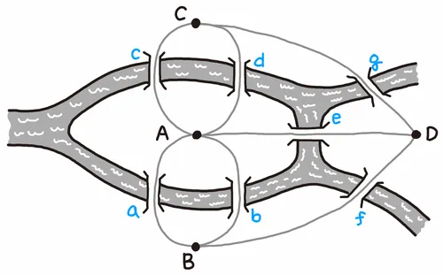

## 오일러 경로
오일러는 '쾨니히스베르크의 다리 문제'를 풀었을까? 오일러는 이 문제를 각각의 다리에 a부터 g까지 이름을 부여하였다. 이를 현대식 그래프 구조에 따라 나타내면 다음과 같다.

위의 그림과 같이 <strong>A부터 D까지를 정점(Vertex), a부터 g까지를 간선(Edge)</strong>라고 한다.

오일러는 **모든 정점이 짝수 개의 차수(Degree)를 갖는다면 모든 다리를 한 번씩만 건너서 도달한다는 것이 성립**한다고 말했다. 후에 수학적으로 증명되면서, 이를 <strong>'오일러의 정리(Euler's Theorem)'</strong>라 부른다. 아울러 모든 간선을 한 번씩 방문하는 유한 그래프를 일컬어 오일러 경로(Eulerian Path)라 부른다.